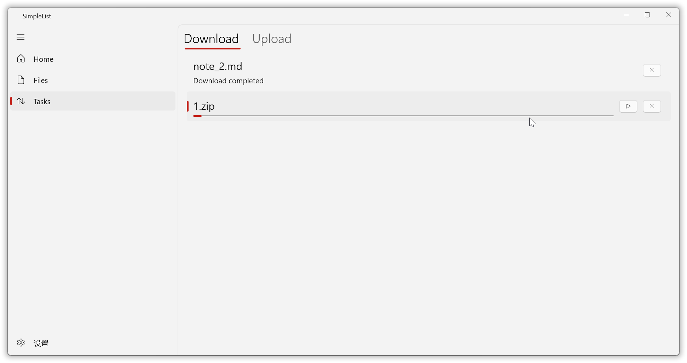

# SimpleList

English | [简体中文](./README_zh_CN.md)

SimpleList is a OneDrive files index application developed using WinUI3.

# Usage

Unzip and then double click

# Features

- [x] Index
- [x] Download
- [ ] Preview
- [ ] Download progress
- [x] Upload
- [ ] Automatic synchronization
- [x] Rename
- [x] Delete
- [ ] Properties
- [x] Total usage
- [ ] Open in new tab
- [ ] Custom theme
- [ ] Multiple accounts

# Screenshots

