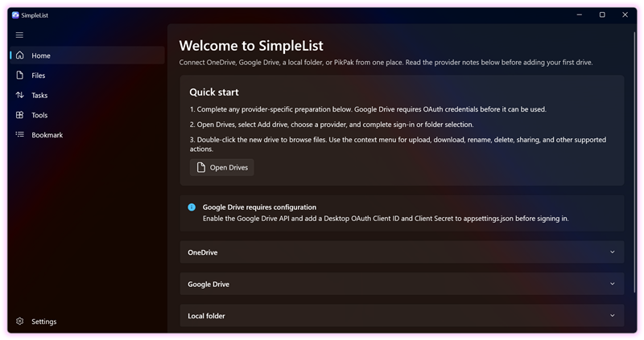
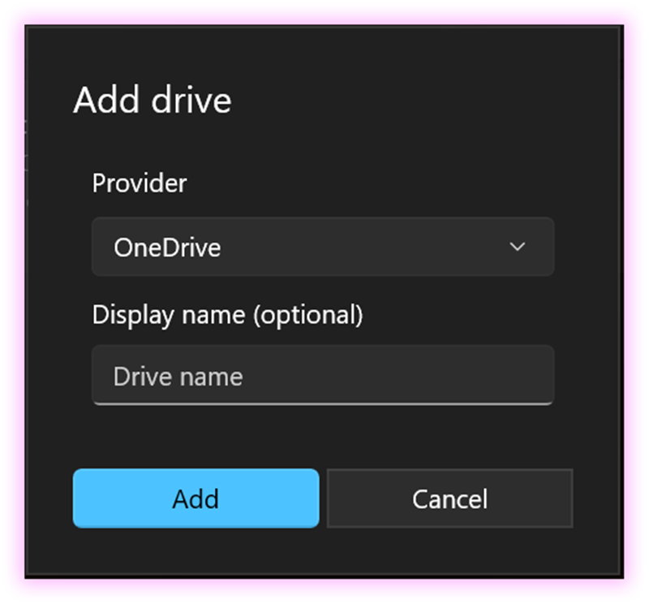
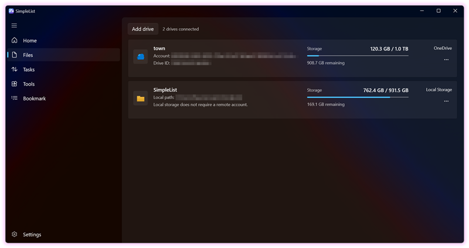
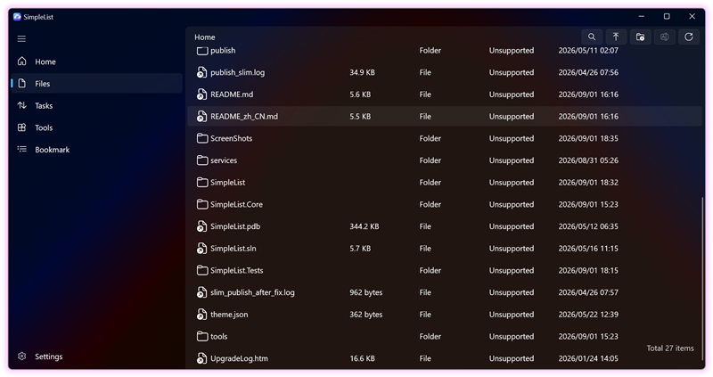
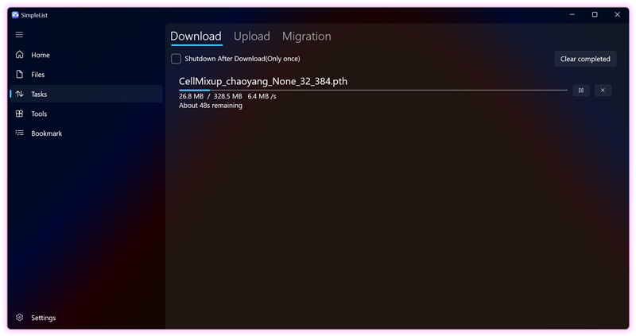
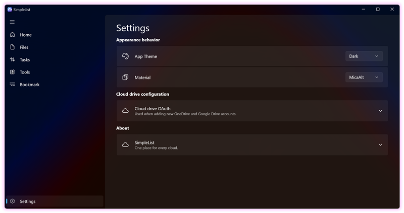
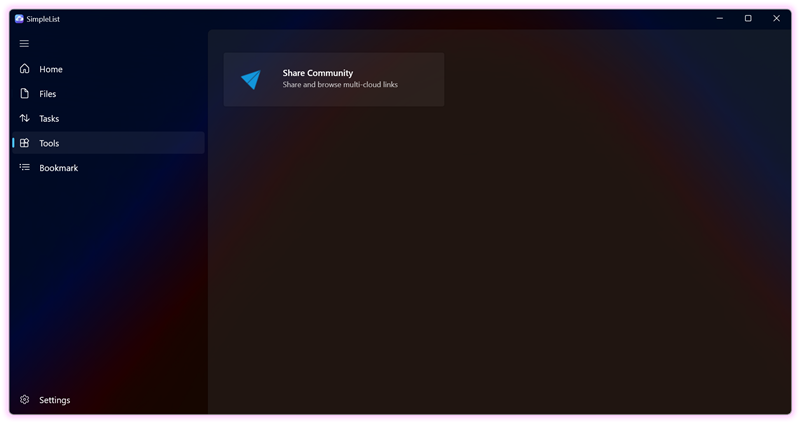
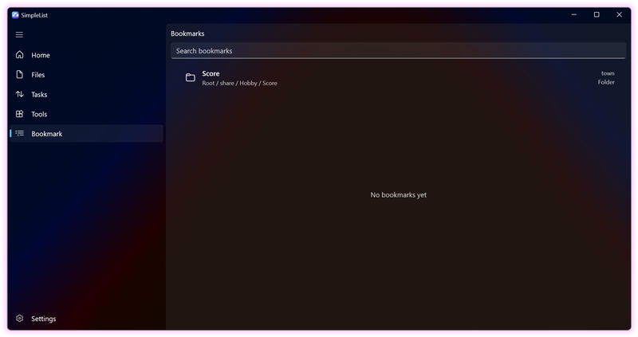

# SimpleList

English | [简体中文](./README_zh_CN.md)


SimpleList is a WinUI 3 multi-cloud file manager for Windows. It brings OneDrive, Google Drive, local folders, and PikPak into one interface, with cross-provider migration, task tracking, bookmarks, previews, sharing, and trash management.

## Highlights

- Connect multiple accounts and mix cloud providers with local folders.
- Browse, search, upload, download, rename, delete, preview, and inspect files.
- Migrate files and folders between providers with progress and cancellation.
- Track downloads, uploads, and migrations in one task manager.
- Bookmark cloud or local locations for quick access.
- Create public links and publish supported links to the Share Community.
- Use column, grid, and image layouts, batch rename, drag and drop, and external downloaders.
- Switch between light, dark, and system themes with localized English and Chinese UI.

## Provider support

| Capability | OneDrive | Google Drive | Local folder | PikPak |
| --- | :---: | :---: | :---: | :---: |
| Browse / search / download | ✅ | ✅ | ✅ | ✅ |
| Upload files and folders | ✅ | ✅ | ✅ | — |
| Rename / delete | ✅ | ✅ | ✅ | ✅ |
| Trash management | ✅ | ✅ | — | ✅ |
| Public share links | ✅ | ✅ | — | — |
| Link password / expiration | ✅ | — | — | — |
| Migrate from this provider | ✅ | ✅ | ✅ | ✅ |
| Migrate to this provider | ✅ | ✅ | ✅ | — |
| Convert to PDF | ✅ | Native Google Docs only | — | — |

PikPak upload, share-link creation, PDF conversion, and use as a migration destination are not available yet.

## Quick start

1. Download the `Portable` package for your architecture from GitHub Releases.
2. Extract the archive and run `SimpleList.exe`.
3. Open **Files**, choose **Add drive**, and select a provider.
4. Complete the provider sign-in, or select a local folder.

Google Drive requires a Desktop OAuth client. Open **Settings → Cloud OAuth** and enter the Client ID and Client Secret created in Google Cloud Console after enabling the Drive API and configuring the OAuth consent screen.

## Configuration

Release defaults are shipped in `SimpleList/appsettings.defaults.json`. User overrides are written by the Settings page to:

```text
%LOCALAPPDATA%\SimpleList\appsettings.json
```

For compatibility, an `appsettings.json` beside `SimpleList.exe` is also loaded when present. User settings take precedence over both the release defaults and the legacy side-by-side file.

Google OAuth tokens are stored under `cache/GoogleDriveTokenCache/`. OneDrive uses the MSAL cache, while PikPak and Share Community credentials use Windows Password Vault.

## Release packages

GitHub Releases publish x64, x86, and ARM64 builds in three flavors:

| Flavor | Description | Best for |
| --- | --- | --- |
| Portable | Self-contained; includes the required .NET and Windows App Runtime components. | Most users |
| SingleFile | Self-contained single executable; bundled WinUI files are extracted automatically at startup. | Users who prefer one application binary |
| Slim | Smaller framework-dependent package; requires the matching .NET 10 Desktop Runtime and Windows App Runtime 2.4. | Machines with runtimes already installed |

Artifact examples:

- `SimpleList-vVERSION-x64-Portable.zip`
- `SimpleList-vVERSION-x64-SingleFile.zip`
- `SimpleList-vVERSION-x64-Slim.zip`

## Architecture

The repository contains three .NET projects and one independently deployed service:

- **SimpleList** — WinUI 3 desktop UI, dependency injection, provider setup, and task orchestration.
- **SimpleList.Core** — provider-neutral contracts and models, plus OneDrive, Google Drive, local, and PikPak providers.
- **SimpleList.Tests** — xUnit coverage for storage results, migrations, paging, path boundaries, provider mapping, authentication helpers, and persistence.
- **services/link-share** — Go/Fiber Share Community backend with SQLite, access/refresh tokens, and compatible v1/v2 APIs.

Adding another provider starts with implementing `IStorageProvider` in `SimpleList.Core`, then wiring the provider into `App.xaml.cs`, drive persistence, and the Add Drive dialog.

## Build and test

Requirements: Windows 10 1809 or later, .NET 10 SDK, Windows App SDK tooling, and Visual Studio with the Windows desktop development workloads.

```powershell
dotnet restore SimpleList.sln
dotnet build SimpleList.sln -c Debug -p:Platform=x64
dotnet test SimpleList.Tests\SimpleList.Tests.csproj -c Release -p:Platform=x64
```

The current suite contains 71 .NET tests. The Share Community service has its own Go checks:

```powershell
cd services\link-share
go test ./...
go vet ./...
```

Publish a self-contained x64 build:

```powershell
dotnet publish .\SimpleList\SimpleList.csproj -c Release -r win-x64 -p:Platform=x64 -p:PublishFlavor=Portable
```

Use `-p:PublishFlavor=SingleFile` for the single-executable build.

Pull requests affecting the desktop app run tests, build the WinUI project, publish Portable, SingleFile, and Slim packages, and verify required release files. Changes under `services/link-share` run Go tests, vet, and build independently.

## Screenshots

| Home and provider guide | Add a provider |
| --- | --- |
|  |  |

| Connected drives | File browser |
| --- | --- |
|  |  |

| Task manager | Settings |
| --- | --- |
|  |  |

| Tools | Bookmarks |
| --- | --- |
|  |  |

## Stargazers over time

[](https://starchart.cc/aiguoli/SimpleList)
