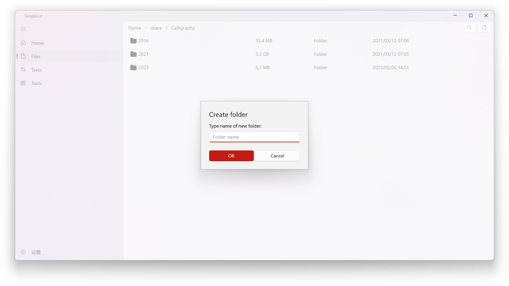
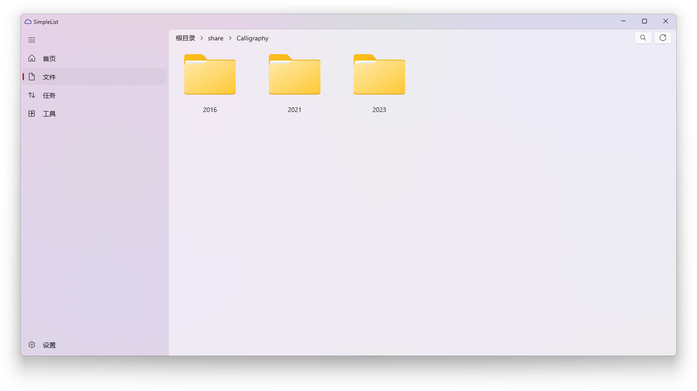
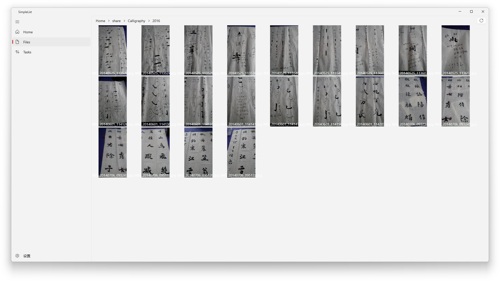
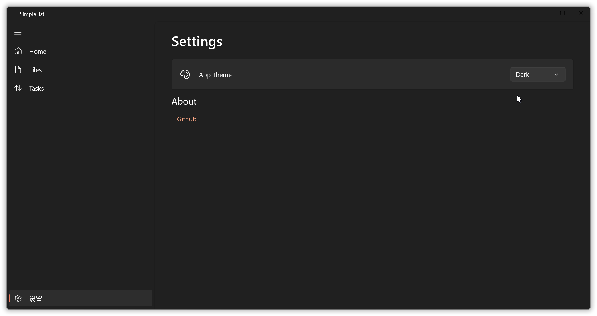

# SimpleList

English | [简体中文](./README_zh_CN.md)


SimpleList is a OneDrive files index application developed using WinUI3.

# Usage

Unzip and then double click

# Release Flavors

Two package flavors are provided in GitHub Releases.

| Flavor | Description | Typical size | Best for |
| --- | --- | --- | --- |
| Portable | Self-contained package. No preinstalled .NET runtime required. | Larger | End users who want zero setup |
| Slim | Framework-dependent package. Requires matching .NET runtime/Windows App SDK runtime on target machine. | Smaller | Users who care about download size |

GitHub Releases now publish both flavors for each platform:

- `SimpleList-vVERSION-x64-Portable.zip`
- `SimpleList-vVERSION-x64-Slim.zip`

For Chinese documentation, see [README_zh_CN.md](./README_zh_CN.md).

## Local Publish Examples

Portable (self-contained):

```powershell
dotnet publish .\SimpleList\SimpleList.csproj -c Release -r win-x64 -p:PublishFlavor=Portable
```

Slim (framework-dependent):

```powershell
dotnet publish .\SimpleList\SimpleList.csproj -c Release -r win-x64 -p:PublishFlavor=Slim
```

## Validate CI Locally (Without Running on GitHub)

You can validate workflow logic locally before pushing.

### 1) Validate workflow YAML and action usage

Use [actionlint](https://github.com/rhysd/actionlint):

```powershell
docker run --rm -v "${PWD}:/repo" -w /repo rhysd/actionlint:latest
```

### 2) Simulate the publish matrix locally

Run all flavors and platforms with a local script:

```powershell
$platforms = @("x64", "x86", "arm64")
$flavors = @("Portable", "Slim")
foreach ($p in $platforms) {
	foreach ($f in $flavors) {
		dotnet publish .\SimpleList\SimpleList.csproj -c Release -r "win-$($p.ToLower())" -p:Platform=$p -p:PublishFlavor=$f
	}
}
```

### 3) Verify release notes content generation locally

The workflow generates `RELEASE_BODY.md` and appends `CHANGELOG.md`. You can execute the same shell snippet locally (Git Bash/WSL) and inspect the output file before pushing.

# Settings

Modify `SimpleList/appsettings.json` to customize the configuration. 

# Features

- [x] Index
- [x] Download
- [x] Share
- [x] Preview
- [x] Download progress
- [x] Upload
- [ ] Automatic synchronization
- [x] Rename
- [x] Delete
- [x] Properties
- [x] Total usage
- [x] Convert to PDF
- [ ] Open in new tab
- [ ] Custom theme
- [x] Multiple accounts
- [x] i18n
- [x] Tools page

# Screenshots(may not be the latest version)











# Stargazers over time

[](https://starchart.cc/aiguoli/SimpleList)
