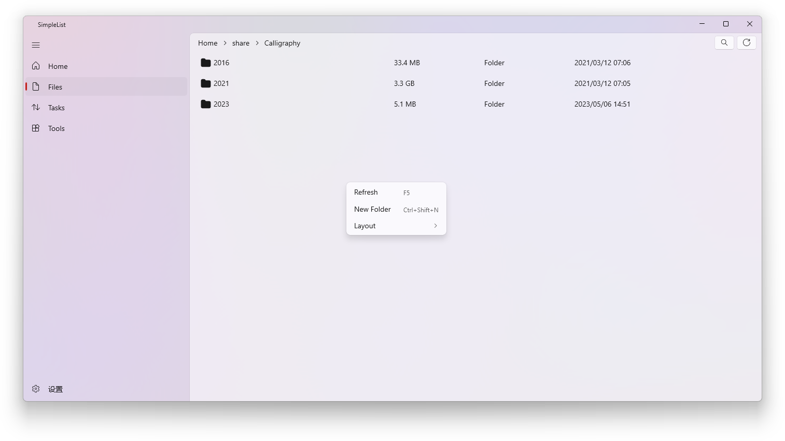
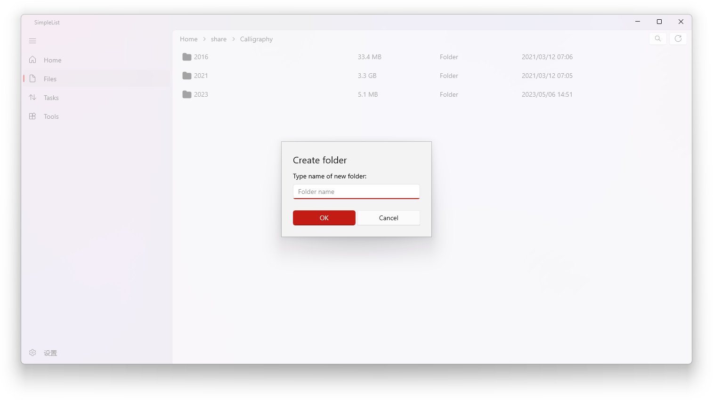
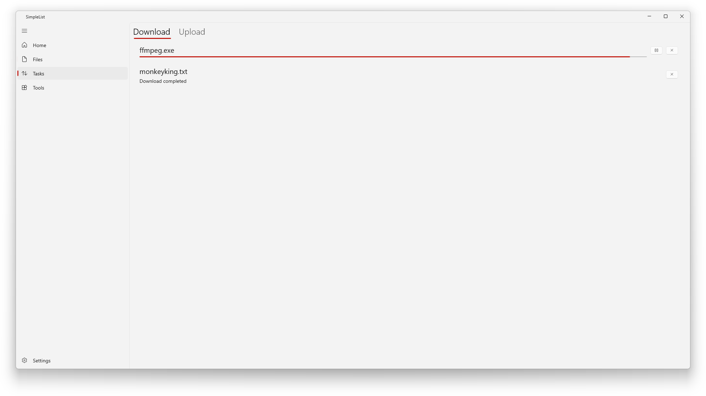
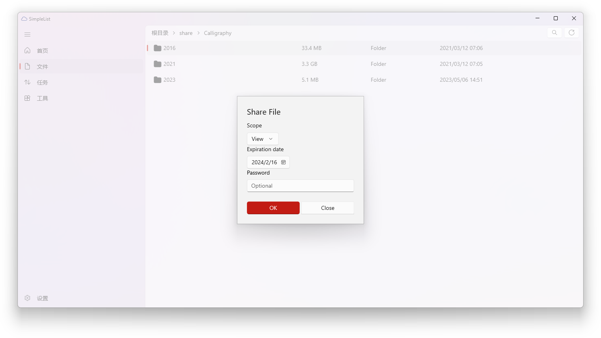
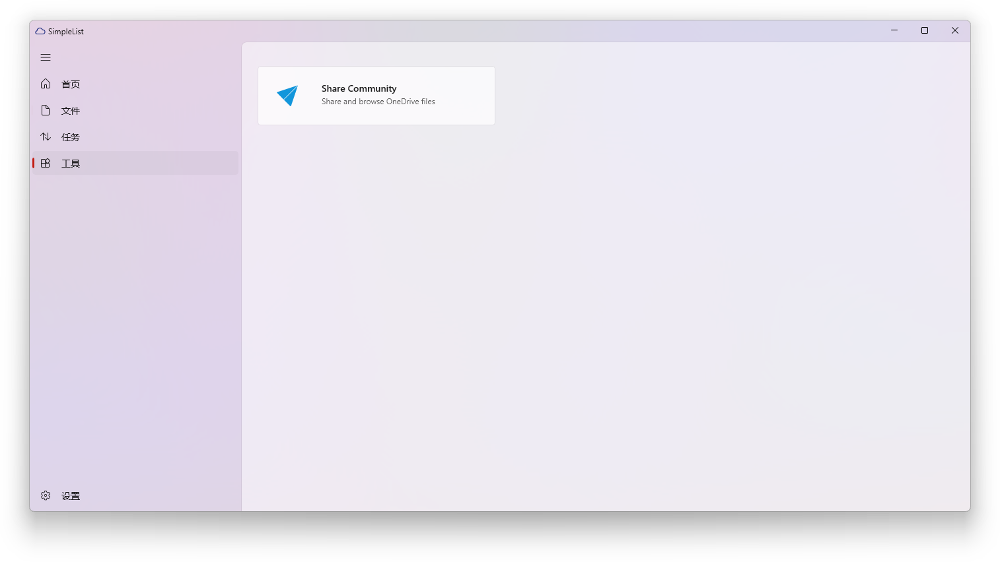
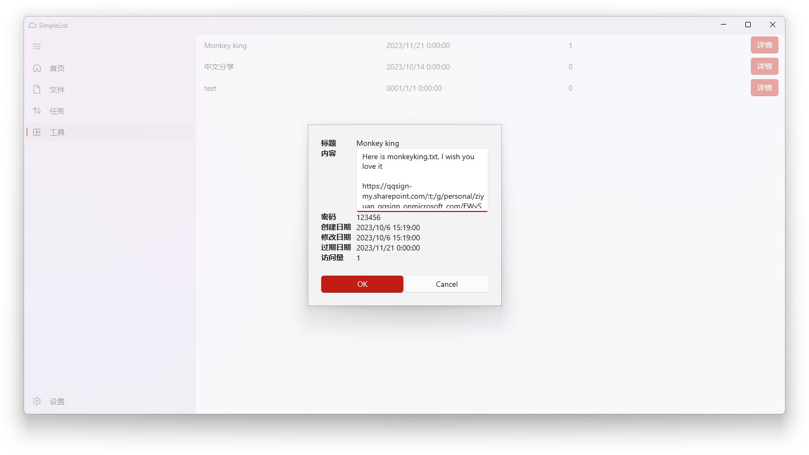
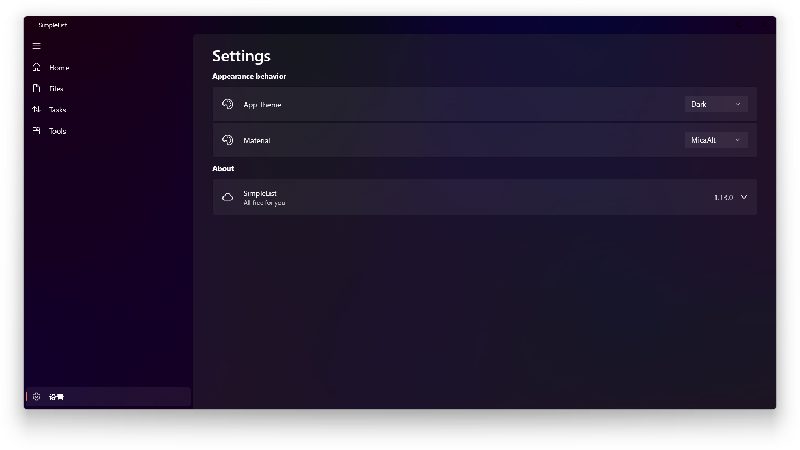

# SimpleList

English | [简体中文](./README_zh_CN.md)

SimpleList is a OneDrive files index application developed using WinUI3.

# Usage

Unzip and then double click

# Sttings

Modify `SimpleList/appsettings.json` to customize the configuration. 

# Features

- [x] Index
- [x] Download
- [x] Share
- [x] Preview
- [x] Download progress
- [x] Upload
- [ ] Automatic synchronization
- [x] Rename
- [x] Delete
- [x] Properties
- [x] Total usage
- [x] Convert to PDF
- [ ] Open in new tab
- [ ] Custom theme
- [x] Multiple accounts
- [x] i18n
- [x] Tools page

# Screenshots

# Stargazers over time

