# SimpleList

[English](./README.md) | 简体中文

OneDrive列表程序，使用WinUI3开发

# 使用方法

解压后双击打开

# 功能

- [x] 列表
- [x] 下载
- [x] 共享
- [ ] 预览
- [x] 下载进度
- [x] 上传
- [ ] 自动同步
- [x] 重命名
- [x] 删除
- [x] 属性
- [x] 总用量
- [x] 转换为PDF文件
- [ ] 新tab打开
- [ ] 自定义主题
- [x] 多账户
- [x] 多语言
- [x] 工具页 

# 技术选型

WinForms，WPF太老了，Avalonia坑太多了用不明白，HTML+CSS+JS的框架又太大，Iced和Slint生态不知道怎样，不敢上手，遂选用WinUI3，发现写起来很爽，文档也比较完整。第一次写桌面端和WinUI3，权当练手项目了。

# 截图

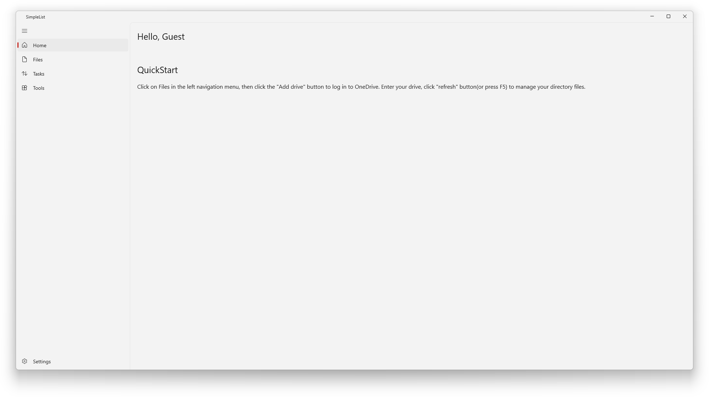
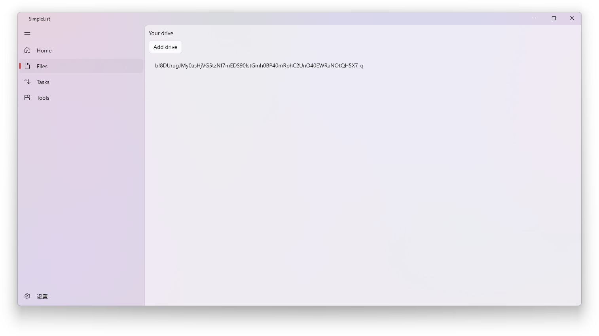
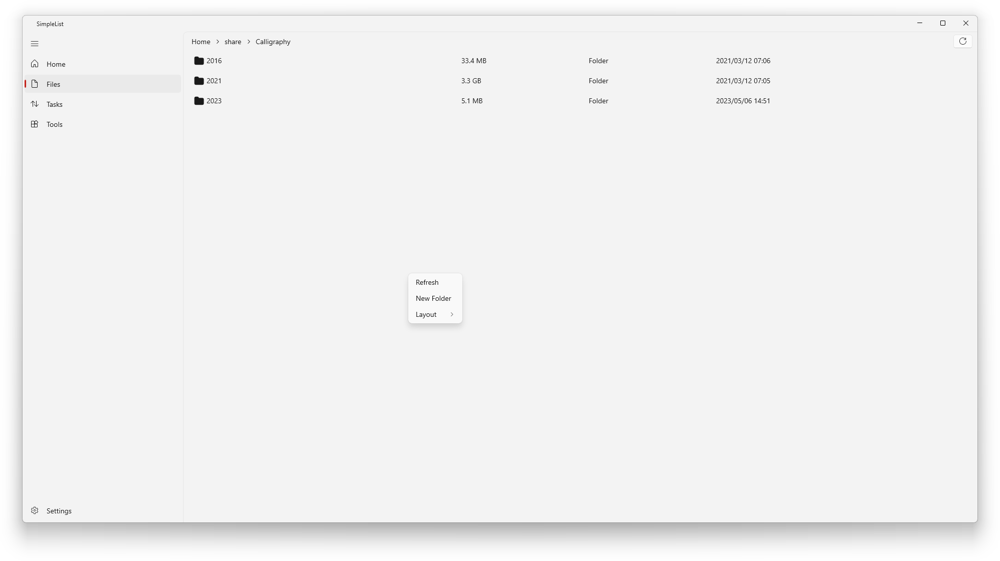
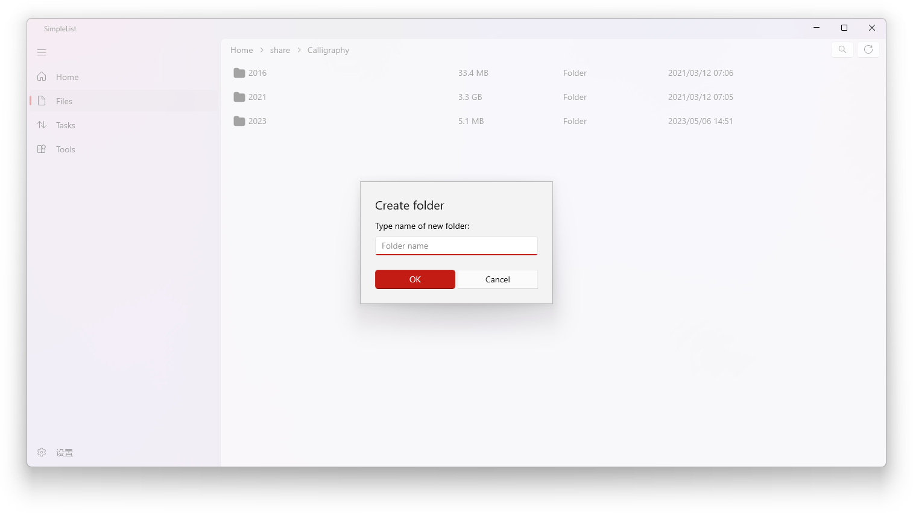
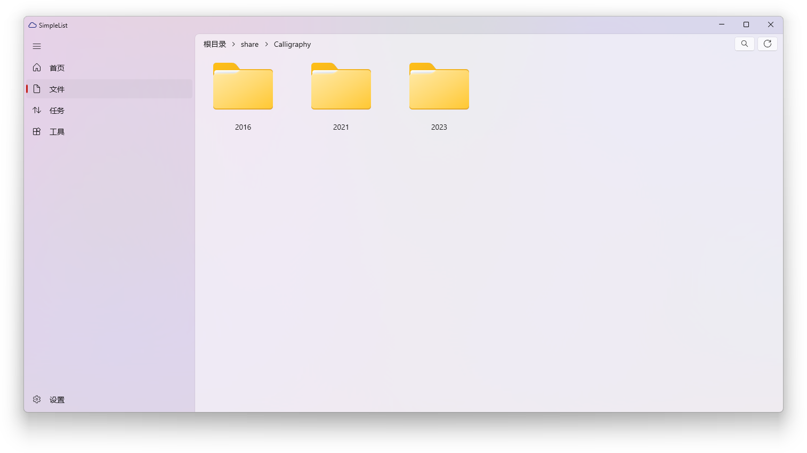
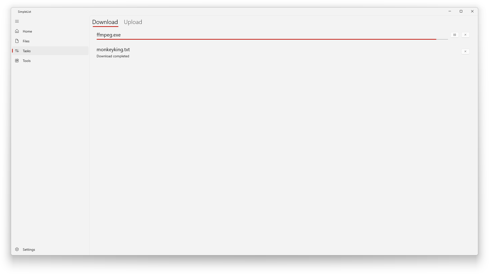
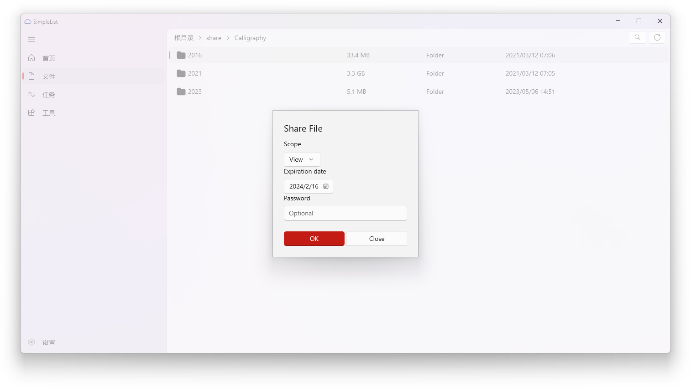
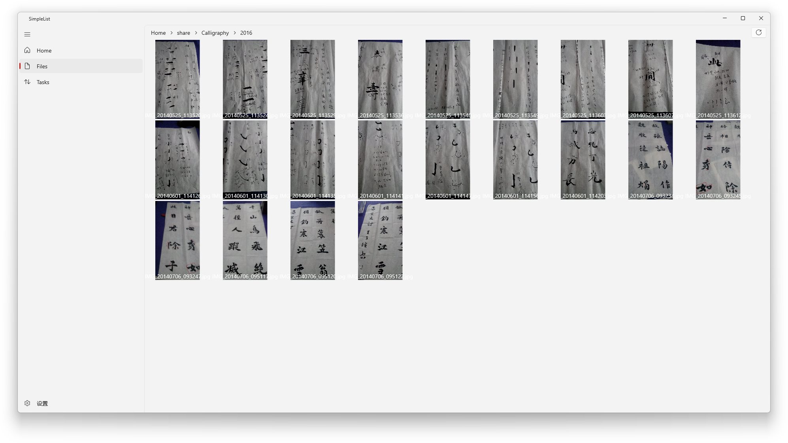
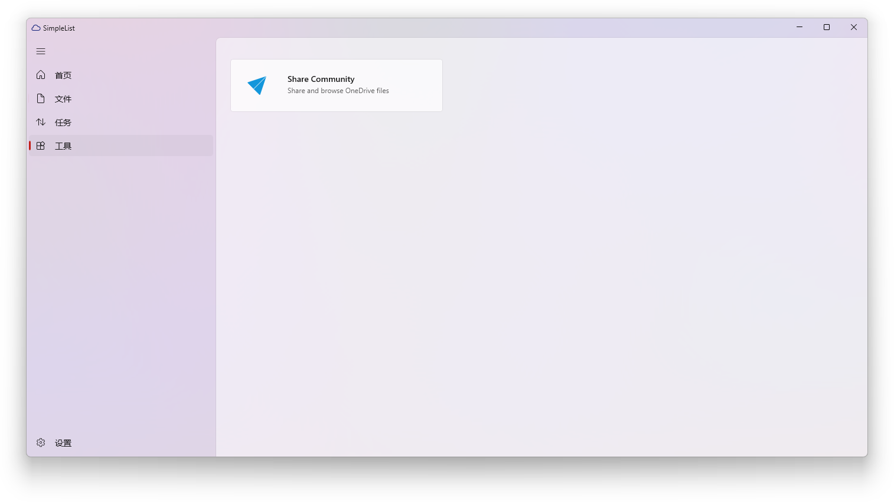
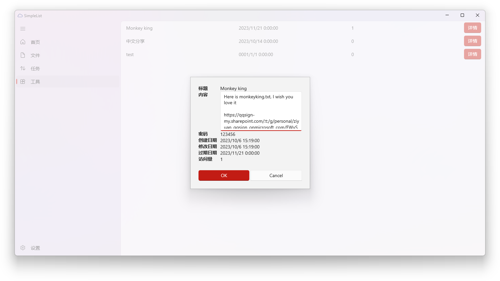
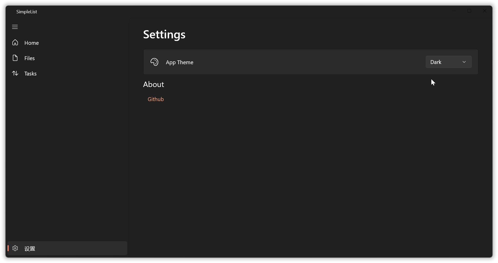
