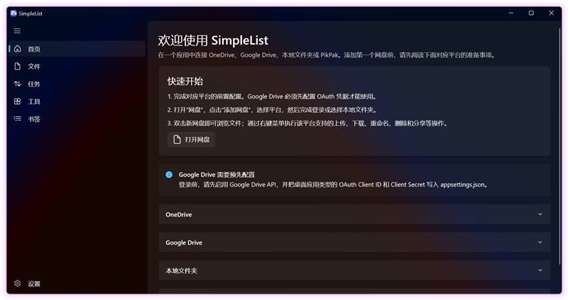
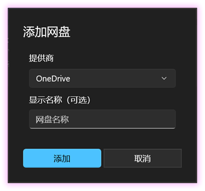
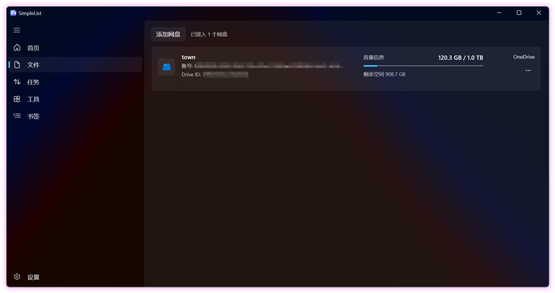
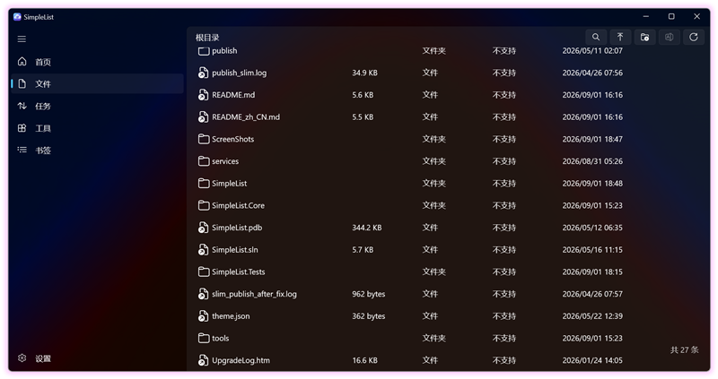
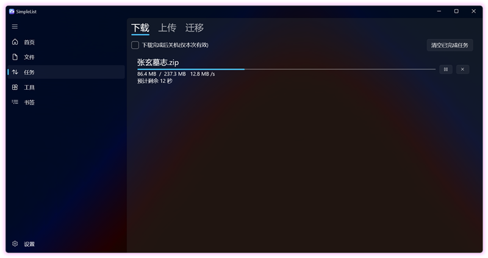
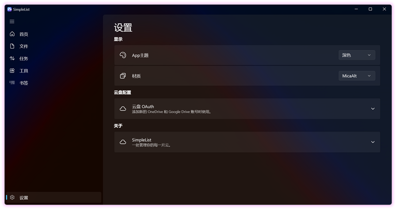
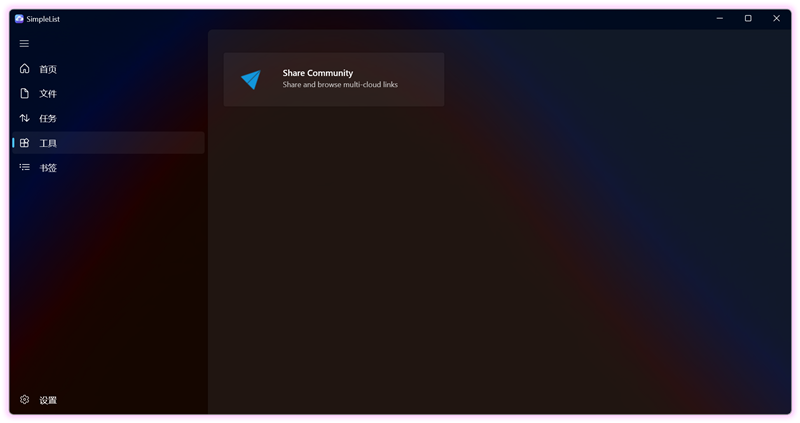
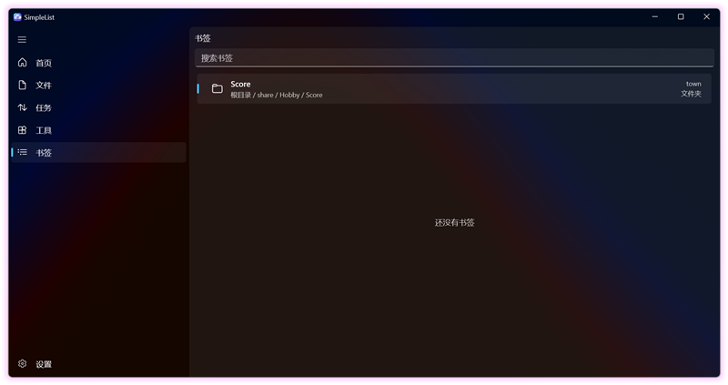

# SimpleList

[English](./README.md) | 简体中文


SimpleList 是一个面向 Windows 的 WinUI 3 多网盘文件管理器。它把 OneDrive、Google Drive、本地文件夹和 PikPak 集中到同一个界面，并提供跨网盘迁移、任务管理、书签、预览、分享与回收站等功能。

## 主要功能

- 同时连接多个账号，并混合使用云端网盘与本地文件夹。
- 浏览、搜索、上传、下载、重命名、删除、预览和查看文件属性。
- 在不同提供商之间迁移文件或文件夹，支持进度显示与取消。
- 在任务管理器中统一查看下载、上传与迁移任务。
- 收藏云端或本地位置，通过书签快速返回。
- 创建公开链接，并把支持的链接发布到分享社区。
- 支持列表、网格与图片布局、批量重命名、拖放和外部下载器。
- 支持浅色、深色、跟随系统主题以及中英文界面。

## 提供商能力

| 能力 | OneDrive | Google Drive | 本地文件夹 | PikPak |
| --- | :---: | :---: | :---: | :---: |
| 浏览 / 搜索 / 下载 | ✅ | ✅ | ✅ | ✅ |
| 上传文件和文件夹 | ✅ | ✅ | ✅ | — |
| 重命名 / 删除 | ✅ | ✅ | ✅ | ✅ |
| 回收站管理 | ✅ | ✅ | — | ✅ |
| 公开分享链接 | ✅ | ✅ | — | — |
| 链接密码 / 过期时间 | ✅ | — | — | — |
| 作为迁移来源 | ✅ | ✅ | ✅ | ✅ |
| 作为迁移目标 | ✅ | ✅ | ✅ | — |
| 转换为 PDF | ✅ | 仅原生 Google 文档 | — | — |

PikPak 暂不支持上传、创建分享链接、PDF 转换，也不能作为文件迁移的目标端。

## 快速开始

1. 从 GitHub Releases 下载与你的系统架构匹配的 `Portable` 压缩包。
2. 解压后运行 `SimpleList.exe`。
3. 打开 **文件**，点击 **添加网盘**，选择提供商。
4. 完成登录，或选择一个本地文件夹。

Google Drive 需要桌面应用类型的 OAuth 客户端。请先在 Google Cloud Console 中启用 Drive API、配置 OAuth 同意屏并创建凭据，然后在 **设置 → 云盘 OAuth** 中填写 Client ID 与 Client Secret。

## 配置文件

发布包默认配置位于 `SimpleList/appsettings.defaults.json`。设置页会把用户覆盖项写入：

```text
%LOCALAPPDATA%\SimpleList\appsettings.json
```

为兼容旧版本，应用仍会读取与 `SimpleList.exe` 同目录的 `appsettings.json`。LocalAppData 中的用户设置优先级最高。

Google OAuth 令牌默认保存在 `cache/GoogleDriveTokenCache/`。OneDrive 使用 MSAL 缓存；PikPak 与分享社区凭据使用 Windows Password Vault。

## 发布包

GitHub Releases 为 x64、x86 与 ARM64 提供三种版本：

| 版本 | 说明 | 适用场景 |
| --- | --- | --- |
| Portable | 自包含版本，已带有所需的 .NET 与 Windows App Runtime 组件。 | 推荐大多数用户使用 |
| SingleFile | 自包含单可执行文件版本；打包的 WinUI 文件会在启动时自动解压。 | 希望只保留一个程序文件的用户 |
| Slim | 体积更小，目标机器需预装匹配架构的 .NET 10 Desktop Runtime 与 Windows App Runtime 2.4。 | 已安装运行时的电脑 |

产物名称示例：

- `SimpleList-vVERSION-x64-Portable.zip`
- `SimpleList-vVERSION-x64-SingleFile.zip`
- `SimpleList-vVERSION-x64-Slim.zip`

## 项目结构

仓库包含三个 .NET 项目和一个独立部署的服务：

- **SimpleList** —— WinUI 3 桌面界面、依赖注入、提供商配置与任务编排。
- **SimpleList.Core** —— 网盘无关的接口和领域模型，以及 OneDrive、Google Drive、本地与 PikPak Provider。
- **SimpleList.Tests** —— 覆盖存储结果、迁移、分页、路径边界、Provider 映射、认证辅助逻辑与持久化的 xUnit 测试。
- **services/link-share** —— 使用 Go/Fiber、SQLite、访问令牌与刷新令牌实现的分享社区后端，同时保留兼容 v1/v2 API。

新增网盘提供商时，先在 `SimpleList.Core` 中实现 `IStorageProvider`，再接入 `App.xaml.cs`、网盘持久化与“添加网盘”对话框。

## 构建与测试

开发环境需要 Windows 10 1809 或更高版本、.NET 10 SDK、Windows App SDK 工具，以及安装了 Windows 桌面开发工作负载的 Visual Studio。

```powershell
dotnet restore SimpleList.sln
dotnet build SimpleList.sln -c Debug -p:Platform=x64
dotnet test SimpleList.Tests\SimpleList.Tests.csproj -c Release -p:Platform=x64
```

当前共有 71 个 .NET 测试。分享社区服务使用独立的 Go 检查：

```powershell
cd services\link-share
go test ./...
go vet ./...
```

发布 x64 自包含版本：

```powershell
dotnet publish .\SimpleList\SimpleList.csproj -c Release -r win-x64 -p:Platform=x64 -p:PublishFlavor=Portable
```

将参数改为 `-p:PublishFlavor=SingleFile` 即可发布单可执行文件版本。

桌面端相关的 Pull Request 会运行测试、构建 WinUI 项目，发布 Portable、SingleFile 与 Slim 三种包，并检查必需的发布文件。`services/link-share` 下的改动会独立运行 Go test、vet 与 build。

## 界面截图

| 首页与提供商说明 | 添加网盘 |
| --- | --- |
|  |  |

| 已连接网盘 | 文件浏览器 |
| --- | --- |
|  |  |

| 任务管理器 | 设置 |
| --- | --- |
|  |  |

| 工具 | 书签 |
| --- | --- |
|  |  |

## Star 趋势

[](https://starchart.cc/aiguoli/SimpleList)
